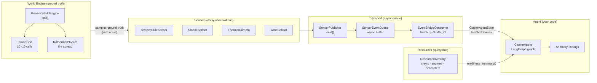

# Diagram 1: Data Pipeline — Layered Architecture

Used in: Session 01, referenced in Sessions 04 and 08.

Key message: the agent never sees the world directly. Everything passes through
layers. The gap between ground truth and sensor observation is intentional.

---

*Design note: the agent receives `ClusterAgentState` — a batch of `SensorEvent`
objects. It never calls `engine.tick()` or reads the grid directly. Resources
are queried by the agent via tools, not pushed automatically.*
