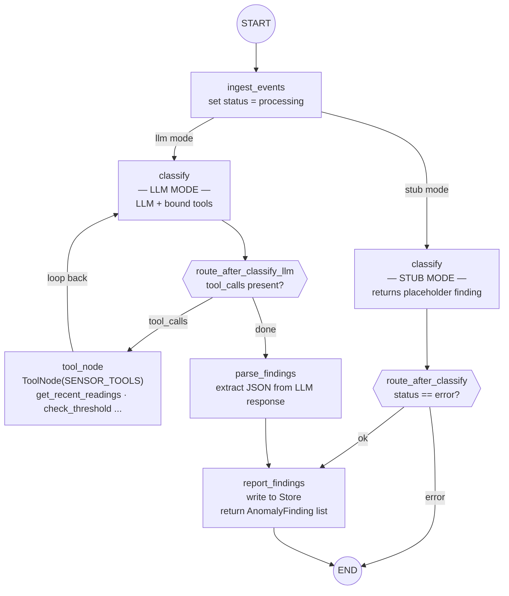

# Diagram 2: Cluster Agent Topology — Stub and LLM Modes

Used in: Sessions 02 (stub) and 03 (LLM).

Key message: the graph structure is the same in both modes. Session 03 replaces
one node (classify) and adds a cycle. Everything else stays identical.

---

*Note: only one of the two `classify` paths exists at runtime — the graph is
compiled with either stub or LLM mode. Both paths share `ingest_events` and
`report_findings` unchanged.*
