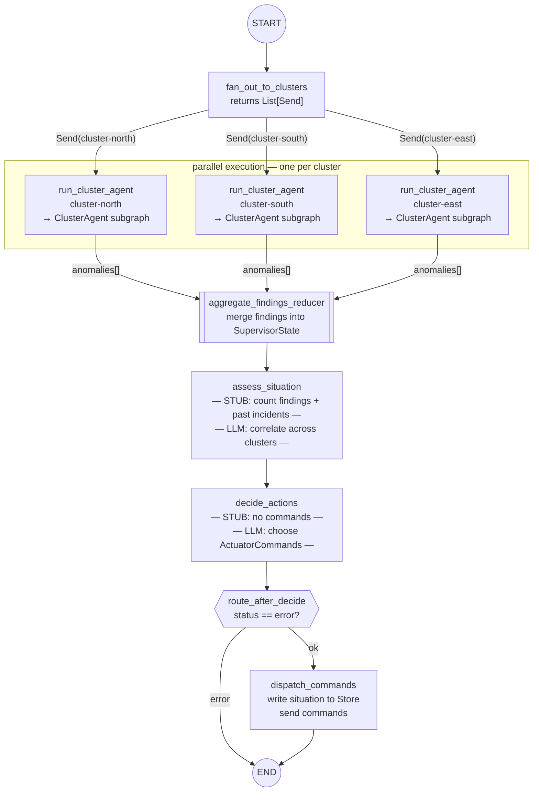

# Diagram 3: Supervisor Fan-out — Send API Pattern

Used in: Sessions 05 (stub) and 06 (LLM).

Key message: the supervisor does not call cluster agents sequentially.
It dispatches all of them in parallel via the Send API. Results are
merged back into supervisor state by a custom reducer — not by the supervisor
node itself.

---

*Note: the number of parallel branches is determined at runtime by
`active_cluster_ids`. Add a cluster → one more branch. No code changes.
This is the key LangGraph skill: dynamic fan-out where the number of
targets is known only at runtime.*
