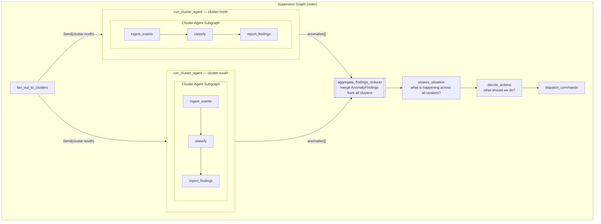

# Diagram 4: How the Supervisor and Cluster Agents Work Together

Used in: Session 05 introduction, and as a bridge between Sessions 02–03 and 05–06.

Key message: the supervisor does not replace the cluster agent — it *contains* it.
Each cluster agent runs as a complete subgraph inside a supervisor node.
The supervisor's job is coordination; the cluster agent's job is classification.

---

## In plain English

**The cluster agent** answers one question: *"What is happening in my cluster right now?"*
- Input: a batch of sensor events from one geographic area
- Output: `AnomalyFinding` objects ("temperature spike", "smoke detected")
- Scope: local — it only knows about its own sensors

**The supervisor** answers a different question: *"What is happening across all clusters, and what should we do about it?"*
- Input: findings from every cluster agent
- Output: `ActuatorCommand` objects ("alert operators", "deploy helicopter")
- Scope: global — it sees everything, but only through findings (never raw sensor data)

**The relationship:**
- The supervisor *invokes* the cluster agent — it calls `cluster_agent_graph.invoke(state)` as a regular Python function call inside the `run_cluster_agent` node
- Each cluster gets its own isolated invocation with its own state — they run in parallel and cannot interfere with each other
- The cluster agent doesn't know it's being called by a supervisor — it just receives a state dict and returns a state dict
- The supervisor doesn't know what the cluster agent does internally — it only sees the `anomalies` field in the returned state

**Why this separation matters:**
You can test the cluster agent completely independently (Sessions 02–03) without a supervisor.
You can test the supervisor with fake findings (Session 05) without real sensors.
When you wire them together (Session 05+), neither one changes — only the orchestration does.
