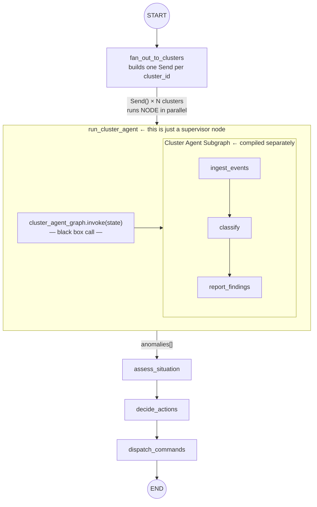

# Diagram 5: Supervisor Invoking the Cluster Subgraph

Used in: Session 05 introduction.

Key message: the cluster agent is a compiled subgraph. The supervisor treats it
as a black box — it passes in a state dict and gets a state dict back.



---

## What "subgraph" means in practice

```
# The cluster agent is compiled once at module load:
cluster_agent_graph = build_cluster_agent_graph()

# The supervisor node just calls it:
def run_cluster_agent(state: ClusterAgentState) -> dict:
    result = cluster_agent_graph.invoke(state)   # ← plain Python call
    return {"cluster_findings": result["anomalies"]}
```

The cluster agent doesn't know it's inside a supervisor.
The supervisor doesn't know what happens inside the cluster agent.
They share nothing except the shape of the state dict passed between them.
